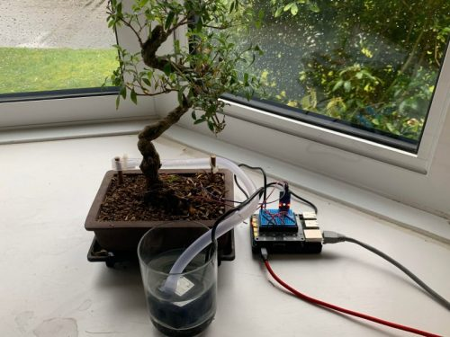

# **Irrigation System μPiHAT  for RaspberryPi Zero**

The irrigation PiHAT can be used for the irrigation of small gardens/vegetable patches via soil moisture level sensing and water dispensing. It may also be used in lab environments where scientists need to hold the moisture level of the soil at a constant level.

An optional configuration, which shows the modular ability of the HAT, is to replace the moisture sensors with a float switch or humidity sensor to either fill up pools; ponds; or water tanks or to operate ventilation systems if an enclosed space reaches a maximum humidity level.

The PiHAT will allow more advanced users to continuously perform measurements or monitor the soil moisture levels by sending its input from the sensors into the main Pi GPIO header.
  

 

# Table of Contents

1. [**Getting Started**](#getting-started)

2. **How To Operate The...**

   - [Amplifier Module](How-To/DesignProcess.md#amplifier-module)
   - [LED Module](How-To/DesignProcess.md#led-module)
   - [Power Module](How-To/DesignProcess.md#power-module)

3. **Circuit Design Process**

   - [Requirements and Specifications](Assignment4/Requirements&Specifications.pdf)
   - [Simulation Output](Simulations/SimulationPlots)
   - [Final Circuit Schematics](Assignment4/Requirements&Specifications)
   - [Combined Circuit Schematic](<FinalCircuitSchematic&PCB/Main Circuit.sch>)

4. **Final PCB Resources**

   - [KiCAD PCB Design File](<FinalCircuitSchematic&PCB/Main Circuit.kicad_pcb>)
   - [Bill of Materials](FinalCircuitSchematic&PCB/BillOfMaterials.md)
   - [Manufacturing Notes](How-To/ManufacturingNotes.md)

5. [**Contributing To This Repo**](CONTRIBUTING.md)

---

 

## Getting Started

Here's how to get started.

 

## Contributing

See the full contribution documentation [here](CONTRIBUTING.md).
